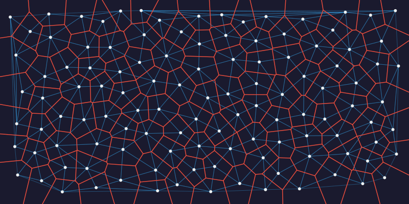
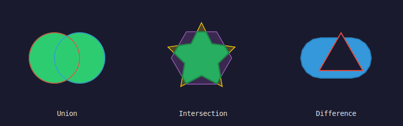
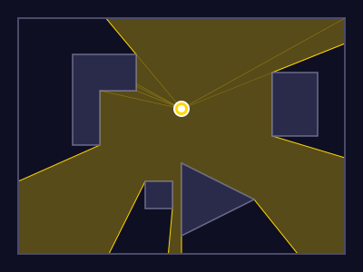
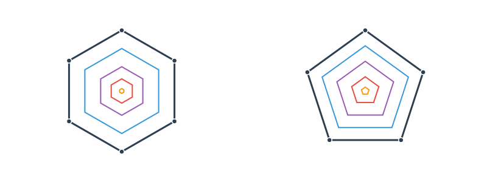
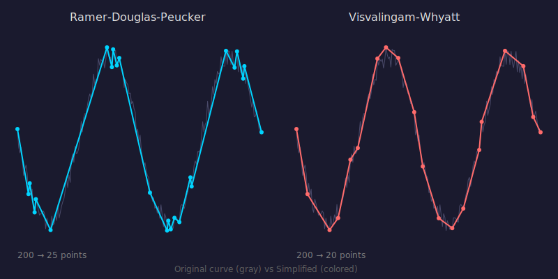
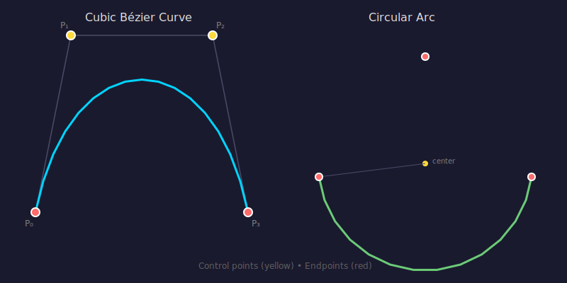
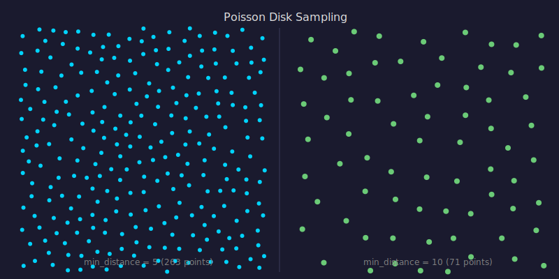
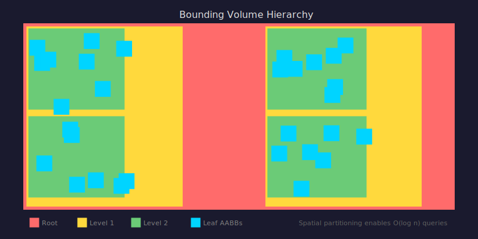
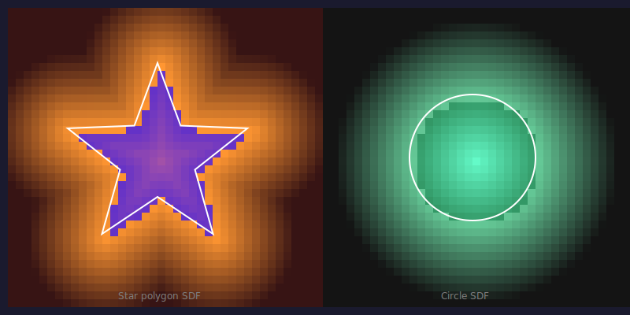

[](https://github.com/timthirion/approxum/actions/workflows/ci.yml)

*"The purpose of computing is insight, not numbers."* - Richard Hamming

Geometric approximation algorithms in Rust. When good enough is good enough.

## Installation

```bash
cargo add approxum
```

## Quick Example

```rust
use approxum::{Point2, simplify, sampling, curves::CubicBezier2};

// Simplify a noisy GPS track
let track: Vec<Point2<f64>> = load_track();
let simplified = simplify::rdp(&track, 0.001);
println!("Reduced {} points to {}", track.len(), simplified.len());

// Generate blue noise points
let points = sampling::poisson_disk(100.0, 100.0, 2.5, 30);

// Discretize a Bézier curve
let curve = CubicBezier2::new(
    Point2::new(0.0, 0.0),
    Point2::new(1.0, 2.0),
    Point2::new(3.0, 2.0),
    Point2::new(4.0, 0.0),
);
let polyline = curve.to_polyline(0.01);
```

## Features

**Polyline Simplification**
- `rdp` - Ramer-Douglas-Peucker (O(n²) worst, O(n log n) typical)
- `visvalingam` - Area-based simplification (O(n log n))
- `topology_preserving` - Prevents self-intersection

**Curve Operations**
- `QuadraticBezier2`, `CubicBezier2` - Bézier curves with adaptive discretization
- `Arc2` - Circular arcs from three points or bulge factor
- `fit_cubic` - Least-squares Bézier fitting to point data
- `offset_cubic_to_polyline` - Parallel curve generation
- `intersect_cubic_cubic` - Curve intersection detection

**Polygon Operations**
- `polygon_union`, `polygon_intersection`, `polygon_difference`, `polygon_xor` - Boolean operations
- `offset_polygon` - Polygon inflation/deflation with miter/bevel/round joins
- `stroke_polyline` - Convert paths to outline polygons
- `straight_skeleton` - Compute straight skeleton for roof generation
- `minkowski_sum`, `minkowski_difference` - Shape dilation/erosion
- `visibility_polygon` - Compute visible area from a point
- `triangulate_polygon` - Ear clipping triangulation
- `convex_decomposition` - Split concave polygons into convex pieces

**Bounding Volumes**
- `Aabb2` - Axis-aligned bounding boxes
- `Obb2` - Oriented bounding boxes
- `BoundingCircle` - Minimum enclosing circle (Welzl's algorithm)
- `BoundingCapsule` - Capsule fitting

**Spatial Data Structures**
- `Bvh` - Bounding volume hierarchy with SAH construction
- `KdTree` - K-d tree for nearest neighbor queries

**Triangulation**
- `delaunay_triangulation` - Delaunay triangulation
- `voronoi_diagram` - Voronoi diagram construction

**Sampling**
- `poisson_disk` - Blue noise sampling (Bridson's algorithm)
- `sobol_sequence` - Low-discrepancy Sobol sequences

**Distance Fields**
- `sdf_circle`, `sdf_polygon` - Signed distance functions
- `distance_transform` - Euclidean distance transform (O(n))
- `SdfGrid` - Grid-based SDF with bilinear sampling

**I/O**
- `parse_svg_path` - Parse SVG path commands
- `svg_path_to_polylines` - Convert SVG paths to polylines
- `polyline_to_svg_path` - Export polylines to SVG

**Tolerance-Aware Predicates**
- `orient2d`, `point_on_segment`, `segments_intersect` - Explicit epsilon parameters
- `hausdorff_distance`, `frechet_distance` - Curve similarity metrics

**SIMD Acceleration** (with `simd` feature)
- Batch point distance calculations
- Vectorized curve evaluation

## Gallery

### Voronoi & Delaunay

Delaunay triangulation (blue) with its dual Voronoi diagram (red).



```rust
use approxum::triangulation::{delaunay_triangulation, voronoi_diagram};
use approxum::sampling::poisson_disk;

let points = poisson_disk(400.0, 300.0, 30.0, 30);
let triangles = delaunay_triangulation(&points);
let voronoi = voronoi_diagram(&points);
```

### Boolean Operations

Union, intersection, and difference of polygons using various shape combinations.



```rust
use approxum::polygon::{polygon_union, polygon_intersection, polygon_difference};

let union = polygon_union(&poly_a, &poly_b);
let intersection = polygon_intersection(&poly_a, &poly_b);
let difference = polygon_difference(&poly_a, &poly_b);
```

### Visibility Polygon

Compute the visible region from a viewpoint within a polygon with obstacles.



```rust
use approxum::polygon::{visibility_polygon_with_obstacles, Polygon};

let room = Polygon::new(room_vertices);
let obstacles = vec![obstacle1, obstacle2];
let visible = visibility_polygon_with_obstacles(&room, &obstacles, viewpoint);
```

### Polygon Offset

Inward offset contours of a hexagon and pentagon, showing progressive shrinking with miter joins.



```rust
use approxum::polygon::{offset_polygon, JoinStyle, Polygon};

let hexagon = Polygon::new(vertices);
let inset = offset_polygon(&hexagon, -15.0, JoinStyle::Miter, 4.0);
```

### Curve Offset

Parallel curves at varying distances from cubic Béziers: an S-curve and a symmetric arc.


```rust
use approxum::curves::{offset_cubic_to_polyline, CubicBezier2};

let curve = CubicBezier2::new(p0, p1, p2, p3);
let offset = offset_cubic_to_polyline(&curve, 15.0, 0.5);
```

### Polyline Simplification



### Bézier Curves & Arc Discretization



### Poisson Disk Sampling



### Bounding Volume Hierarchy



### Signed Distance Field



## Companion to exactum

**approxum** is designed as a companion to [exactum](https://github.com/...), which provides exact integer geometry. Use exactum when correctness is critical; use approxum for:

- Preprocessing noisy input data
- LOD generation and mesh simplification
- Visualization and rendering
- "Good enough" spatial queries

## Minimum Supported Rust Version

Rust 1.70 or later.

## License

Apache-2.0
